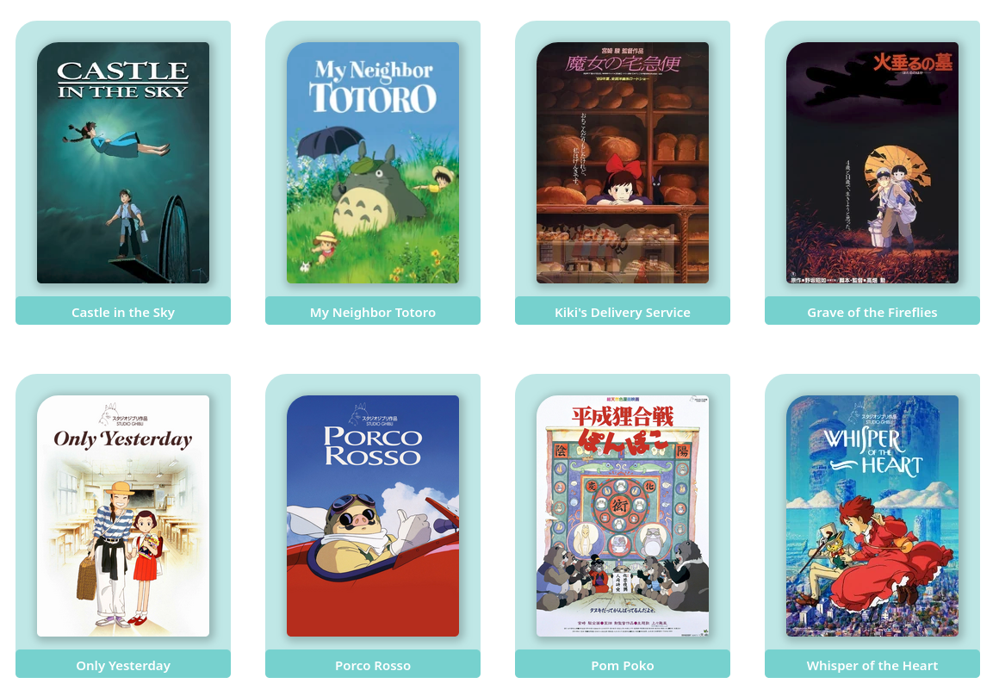

# Exemplo

Você tem um conjunto de filmes. Cada um com título e pôster. É necessário uma aplicação web para mostrar os filmes em linhas e colunas.

* [Solução em React](./react-example/)
* [Solução em Angular](./angular-example/)
